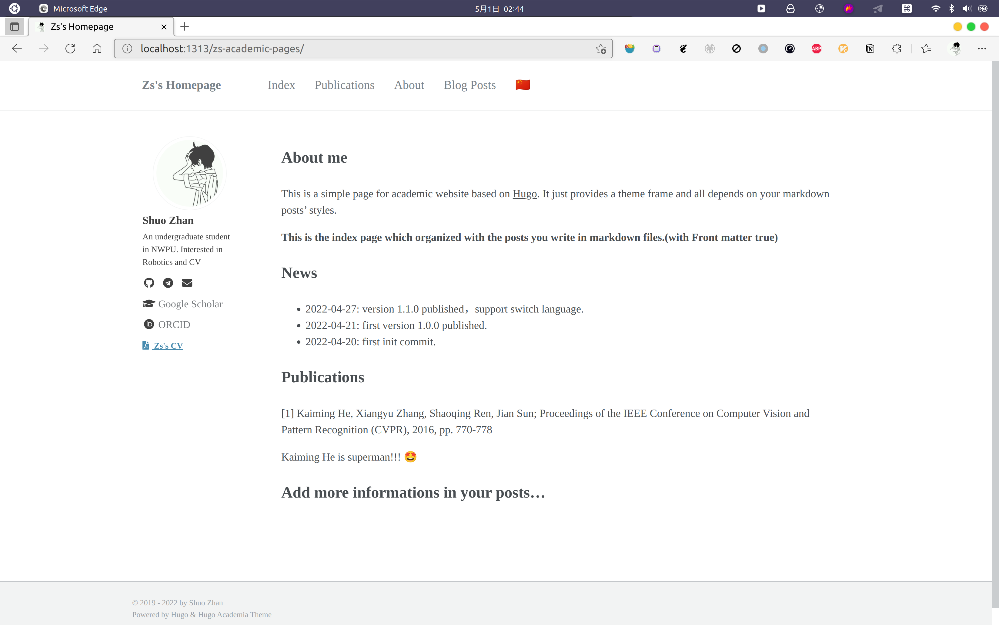
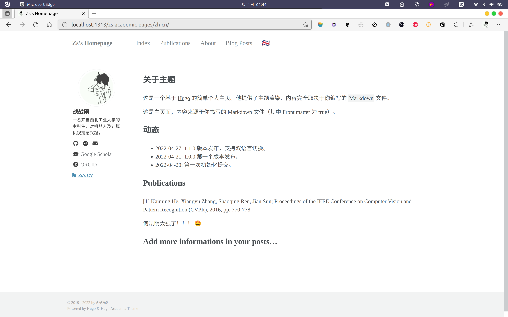

# hugo-academia-theme
<p align="center">
 
</p>



Hugo 版本的个人(学术)主页

> 基于 [Jekyll/academicpages](https://github.com/academicpages/academicpages.github.io) 与 [Hexo/hexo-theme-academia](https://github.com/PhosphorW/hexo-theme-academia).

演示站 : https://zzsqwq.github.io/academic-pages-demo/

演示站源代码 : https://github.com/zzsqwq/academic-pages-demo/


## Features
1. 多语言支持
2. 配置简单且迅速
3. 使用 yaml 文件进行配置



## Quick Start
1. 点击[这里]((https://github.com/gohugoio/hugo/releases))下载 Hugo 并且使用下列命令创建一个新的站点。
```shell
$ hugo new site example_site
```
2. 在新建的站点中初始化 Git 仓库。
```shell
$ cd example_site
$ git init
```
3. 将此主题仓库添加为项目的子模组（当然直接当成一个目录也可以，不过这样更方便）。
```shell
$ git clone https://github.com/zzsqwq/hugo-academia-theme.git themes/hugo-academia
```

4. 配置你的 `config.yaml`. 你可以在[这里](https://github.com/zzsqwq/academic-pages-demo/blob/master/config.yaml)找到一个完整的配置文件。可以基于此进一步配置。

5. 使用 `hugo server` 来预览你的站点。就这么多，恭喜你建成了你的个人主页！


**Ps:** 你也可以 Fork 或者直接克隆演示站点源代码 [academic-pages-demo](https://github.com/zzsqwq/academic-pages-demo) 然后基于此配置。

## 配置主页内容

当一个 Markdown 文件的 Front-matter `homepage` 参数为 true，这个文件的内容将会被展示在主页。

你可以在这里查看[实例文件](https://github.com/zzsqwq/academic-pages-demo/blob/master/content/en/a.md)。

```shell
---
title: "{{ replace .Name "-" " " | title }}"
date: {{ .Date }}
draft: true
homepage: true
---
```

## 关于  `canonifyURLs` 参数

如果你的 `baseURL` 类似于 `https://example.io/homepage`，你可能需要开启这个参数以使用绝对路径。

但是如果你的 `baseURL` 类似与 `https://example.io/`，那不推荐你开启这个参数。

关于这个参数更多的信息，可以参考 [这里](https://gohugo.io/content-management/urls/#canonicalization)。
